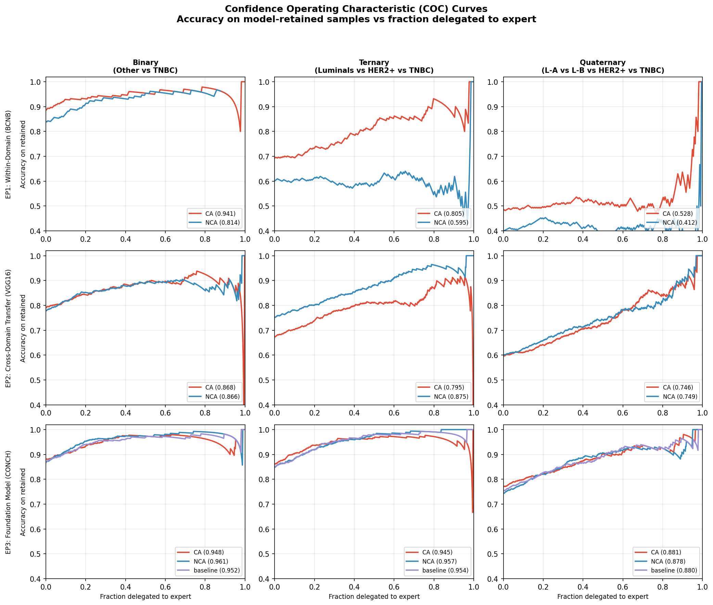
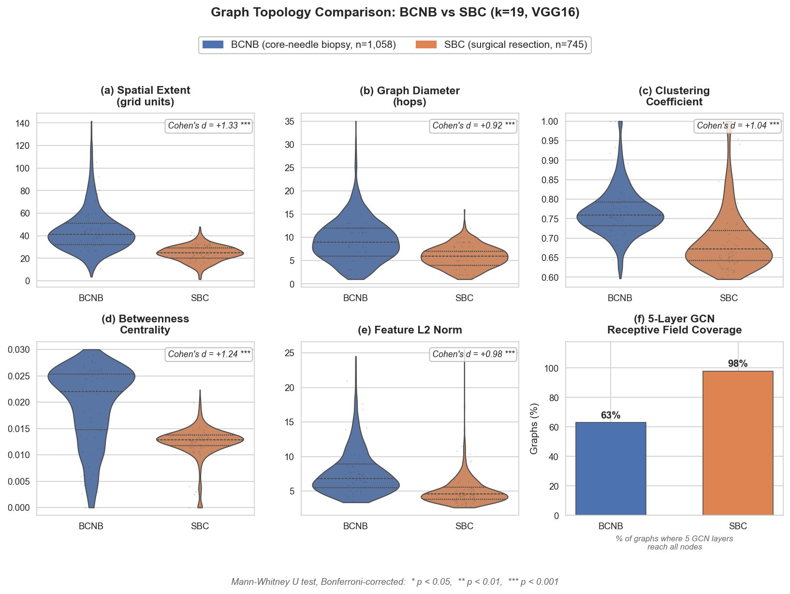
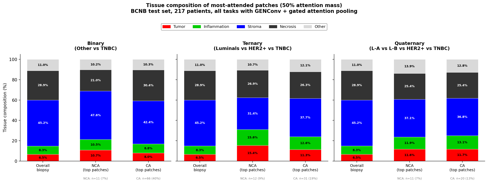

# Spatial Context-Aware Breast Cancer Molecular Subtype Prediction

Official code repository for:

> **Spatial Context-Aware Breast Cancer Molecular Subtype Prediction in Whole-Slide Images using Graph Convolutional Networks: Cross-Domain Evaluation**
>
> Claudio Fernandez-Martin, Umay Kiraz, Emiel A.M. Janssen, Valery Naranjo, Julio Silva-Rodriguez\*, Sandra Morales\*
>
> *Computers in Methods and Programs in Biomedicine* (2025)

## Overview

This repository provides the code for systematically comparing context-aware (graph-based) and non-context-aware (attention-based) aggregation mechanisms for breast cancer molecular subtype prediction from H&E whole-slide images. The framework includes:

- **Three evaluation protocols**: within-domain (BCNB), constrained cross-domain transfer (SBC), and foundation model integration (CONCH)
- **Graph topology analysis**: structural comparison between core-needle biopsy and surgical resection specimens
- **Quantitative interpretability**: attention concentration (Gini), tissue composition enrichment, and spatial coverage (convex hull)
- **Clinical metrics**: per-class sensitivity for TNBC/HER2(+) and Confidence Operating Characteristic (COC) curves

## Repository Structure

```
molecular-subtype-prediction/
  models/                  # Model class definitions
    mil_models.py          # PatchGCN (CA) with GENConv + gated attention
    conch_models.py        # CONCH baseline and attention models
  scripts/
    training/              # Model training and retraining
    inference/             # Run models and save predictions
    evaluation/            # Clinical metrics and statistical tests
    interpretability/      # Attention analysis, GNNExplainer, tissue correlation
    topology/              # Graph topology comparison across domains
    visualization/         # Figures: overlays, tissue composition, confusion matrices
  data/                    # Placeholder (see data/README.md for download instructions)
  weights/                 # Placeholder (see weights/README.md)
  examples/                # Example outputs (figures and CSV results)
  configs/                 # Configuration templates
```

## Installation

```bash
# Clone the repository
git clone https://github.com/cvblab/spatial-gcn-breast-subtype-wsi.git
cd molecular-subtype-prediction

# Create virtual environment
python -m venv venv
source venv/bin/activate  # Linux/macOS

# Install dependencies
pip install -r requirements.txt
```

**Note:** PyTorch and PyTorch Geometric installation depends on your CUDA version. See [PyTorch](https://pytorch.org/get-started/) and [PyG](https://pytorch-geometric.readthedocs.io/en/latest/install/installation.html) installation guides.

## Usage

### Training (Evaluation Protocol 1: Within-Domain)

Retrain GCN models with Monte Carlo cross-validation:

```bash
python scripts/training/retrain_gcn_mccv_generic.py \
    --task 2class \
    --data_dir data/BCNB \
    --output_dir weights/
```

### Constrained Cross-Domain Transfer (Evaluation Protocol 2)

Fine-tune classifiers on the target domain with frozen feature extractors:

```bash
python scripts/training/retrain_classifier_predictions.py \
    --task 2class \
    --source_weights weights/bcnb_2class_ca_genconv_attn.pth \
    --target_data data/SBC
```

### Foundation Model Evaluation (Evaluation Protocol 3)

Train aggregation mechanisms from scratch using CONCH features:

```bash
python scripts/training/conch_classifier_predictions.py \
    --task 2class \
    --conch_features data/SBC/conch_features \
    --output_dir results/conch/
```

### Clinical Metrics and Statistical Tests

```bash
python scripts/evaluation/clinical_metrics.py \
    --predictions results/predictions/ \
    --output results/clinical/
```

### Graph Topology Analysis

```bash
python scripts/topology/graph_topology_analysis.py \
    --bcnb_graphs data/BCNB/graphs/ \
    --sbc_graphs data/SBC/graphs/ \
    --output results/topology/
```

### Interpretability Analysis

```bash
# Extract attention weights
python scripts/interpretability/extract_ca_attention_bcnb.py \
    --weights weights/bcnb_2class_ca_genconv_attn.pth \
    --data data/BCNB

# Compute concentration and spatial coverage metrics
python scripts/interpretability/compute_attention_concentration.py \
    --attention_dir results/attention/ \
    --output results/interpretability/

# Generate tissue overlay visualizations
python scripts/visualization/generate_tissue_overlays.py \
    --patient_id 817 \
    --task 2class \
    --output results/overlays/
```

## Example Outputs

### Clinical Performance (COC Curves)


### Graph Topology Analysis


### Interpretability: Tissue Composition


## Datasets

- **BCNB**: 1,058 core-needle biopsies. Publicly available ([Xu et al., 2021](https://doi.org/10.3389/fonc.2021.759007)).
- **SBC**: 533 surgical resections from Stavanger University Hospital. Available under restricted data access agreement ([Nielsen et al., 2024](https://doi.org/10.3390/cancers17193234)).

## Citation

If you use this code in your research, please cite:

```bibtex
@article{fernandezmartin2025spatial,
  title={Spatial Context-Aware Breast Cancer Molecular Subtype Prediction in Whole-Slide Images using Graph Convolutional Networks: Cross-Domain Evaluation},
  author={Fernandez-Martin, Claudio and Kiraz, Umay and Janssen, Emiel A.M. and Naranjo, Valery and Silva-Rodriguez, Julio and Morales, Sandra},
  journal={Computers in Methods and Programs in Biomedicine},
  year={2025}
}
```

## License

This project is licensed under the MIT License. See [LICENSE](LICENSE) for details.

## Acknowledgments

This work was funded by the Horizon 2020 European Union research and innovation programme under the Marie Sklodowska Curie grant agreement No 860627 (CLARIFY Project), Ayuda a Primeros Proyectos de Investigacion (PAID-06-23) from UPV, and partially by GVA through project CIPROM/2022/20.
